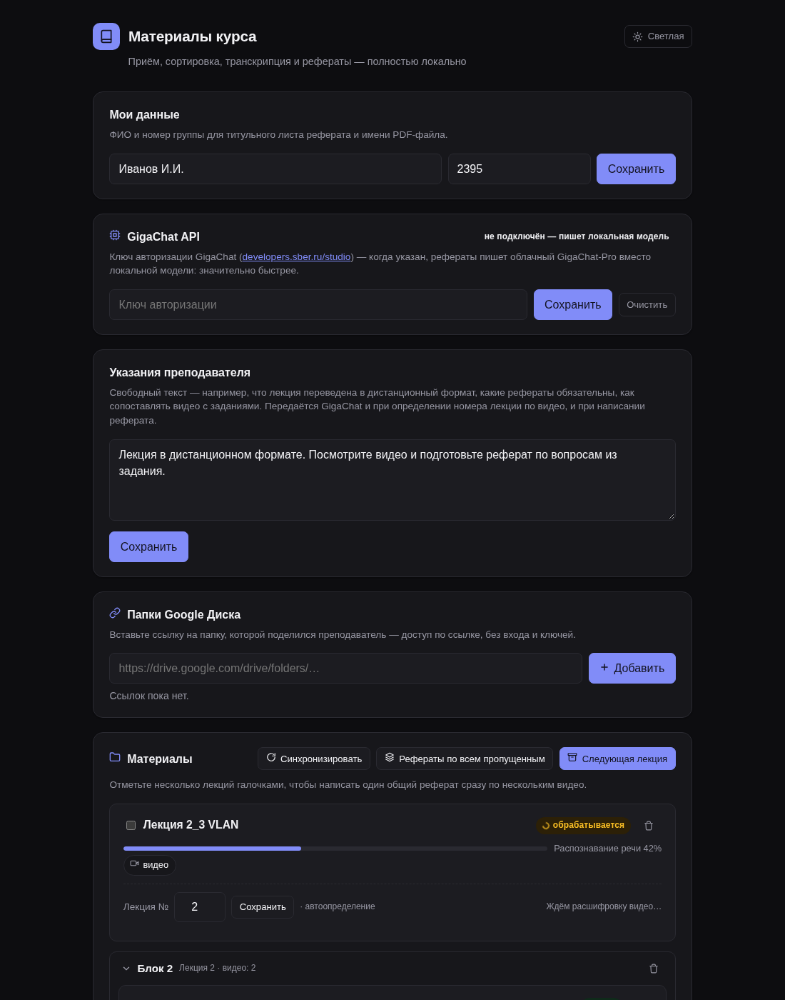
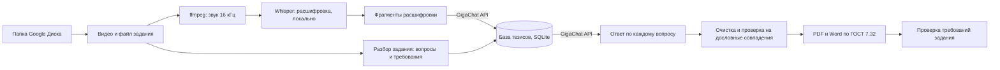
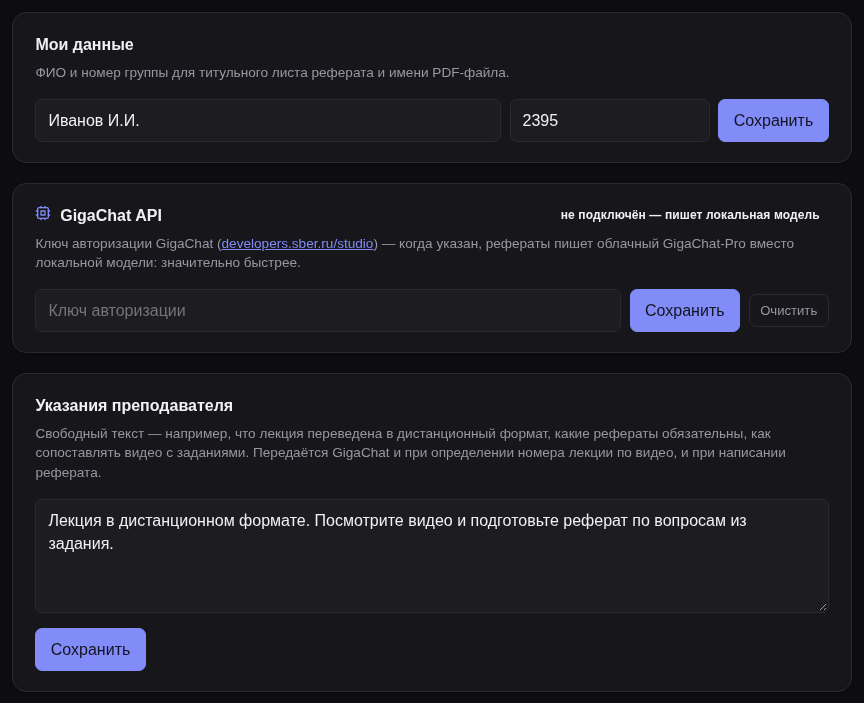
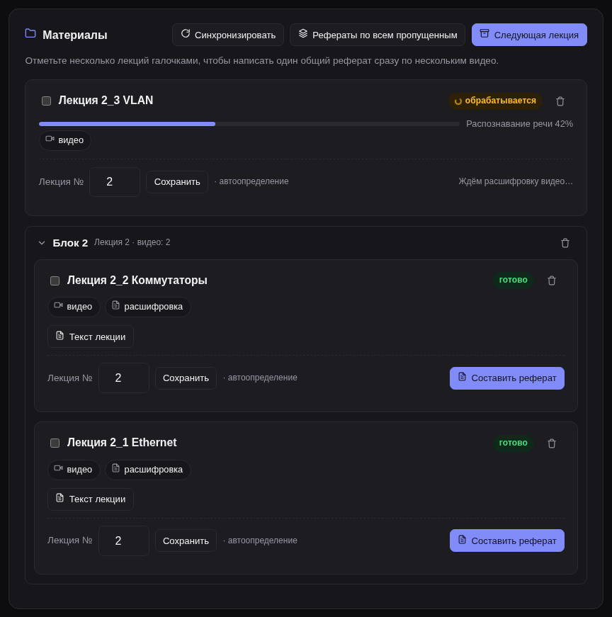
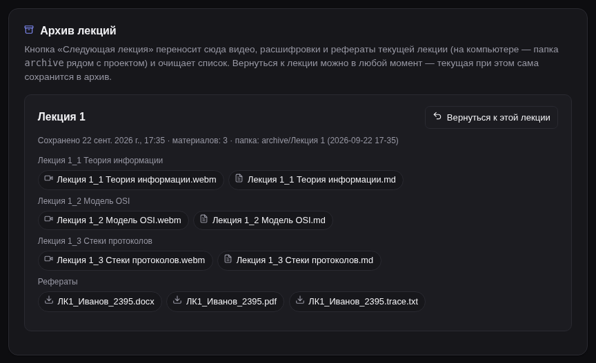
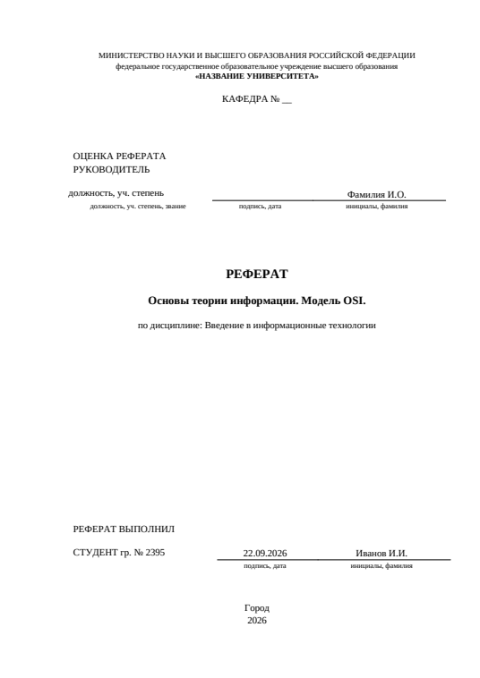
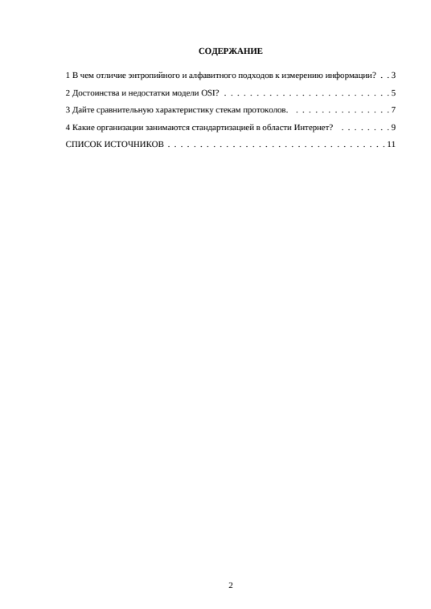
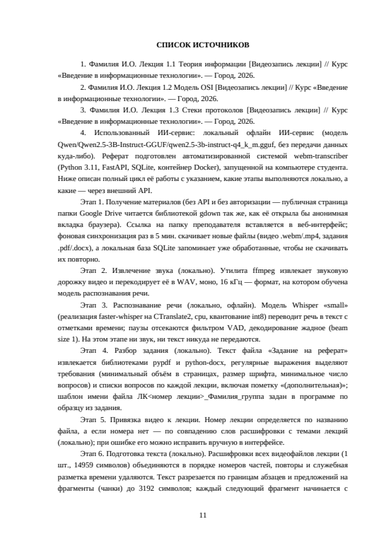

# Рефераты по видеолекциям

Веб-сервис, который берёт видеолекции из папки Google Диска, расшифровывает их у вас на компьютере
и помогает подготовить по ним реферат по вопросам из задания преподавателя. Реферат оформляется
по ГОСТ 7.32-2017 и сохраняется в двух форматах: PDF и Word.

Всё работает внутри Docker-контейнера. Python, ffmpeg и нейросеть для распознавания речи уже есть в
контейнере, отдельно ставить ничего не нужно, кроме Git и Docker Desktop.



## Содержание

1. [Что умеет сервис](#что-умеет-сервис)
2. [Честное использование и оригинальность текста](#честное-использование-и-оригинальность-текста)
3. [Быстрый старт для тех, кто спешит](#быстрый-старт-для-тех-кто-спешит)
4. [Шаг 1. Установка Git и Docker Desktop](#шаг-1-установка-git-и-docker-desktop)
5. [Шаг 2. Скачивание проекта с GitHub](#шаг-2-скачивание-проекта-с-github)
6. [Шаг 3. Данные для титульного листа](#шаг-3-данные-для-титульного-листа)
7. [Шаг 4. Запуск, выключение и обновление](#шаг-4-запуск-выключение-и-обновление)
8. [Шаг 5. Ключ GigaChat API — подробно](#шаг-5-ключ-gigachat-api--подробно)
9. [Шаг 6. Работа в веб-интерфейсе](#шаг-6-работа-в-веб-интерфейсе)
10. [Где лежат файлы](#где-лежат-файлы)
11. [Частые проблемы](#частые-проблемы)
12. [Для разработчиков](#для-разработчиков)

## Что умеет сервис

- **Забирает материалы сам.** Вставляете ссылку на папку Google Диска преподавателя, и сервис
  скачивает новые видео и файл с заданием. Повторно одни и те же файлы не качаются.
- **Расшифровывает речь без интернета.** Звук извлекает `ffmpeg`, текст получает нейросеть Whisper
  (faster-whisper). Всё это происходит внутри контейнера на вашем компьютере, прогресс виден в процентах.
- **Разбирает задание.** Находит список вопросов по каждой лекции, минимальный объём, шрифт,
  минимальное число вопросов и пометку «(дополнительная)».
- **Пишет текст через GigaChat.** Для каждого фрагмента расшифровки модель выписывает тезисы
  лектора в локальную базу знаний. Затем по каждому вопросу пишется отдельный ответ только по этим
  тезисам и фрагментам. Вопросы, которых в лекции не было, в реферат не попадают.
- **Оформляет по ГОСТ.** Титульный лист, содержание с номерами страниц, поля 30/15/20/20 мм,
  Times New Roman 12 пт, интервал 1,5, отступ 1,25 см, нумерация страниц, список источников.
- **Проверяет результат.** Имя файла, объём, шрифт, число вопросов. Если объёма меньше 5 страниц,
  сервис добавляет вопрос или расширяет ответ.
- **Держит порядок.** Видео одной лекции объединяются в сворачиваемые «Блок 1», «Блок 2»…
  Кнопка «Следующая лекция» переносит видео, расшифровки и рефераты в архив. К любой прошлой
  лекции можно вернуться.



## Честное использование и оригинальность текста

**Раскрытие использования ИИ.** В конце каждого реферата, в «Списке источников», сервис
перечисляет видеолекции и отдельным пунктом пишет, какой ИИ-сервис использовался и с какими
промтами. Этого требуют правила оформления рефератов: «если использован ИИ-сервис, то указать какой
промт и какой сервис». Не удаляйте этот пункт. Если сдать сгенерированный текст как полностью свой
и скрыть использование ИИ, это нарушение академической честности, и отвечать за него будете вы.

**Что сервис делает, чтобы ваш реферат не совпадал с чужими.** Одинаковые рефераты аннулируются у
обоих авторов, поэтому сервис:

- пишет каждый реферат моделью заново, по **вашей** расшифровке и **вашей** базе тезисов. Ни
  тексты, ни тезисы между пользователями не передаются: у каждой установки своя база на своём
  компьютере;
- для каждого реферата случайно выбирает один из шести стилей изложения: от общего к частному,
  через определения, через примеры лектора и т. д. Два студента по одной лекции получат
  по-разному построенный текст;
- отправляет модели отдельный запрос пересказать своими словами кусок лекции, если он переписан
  в ответ дословно и длиннее 12 слов подряд. Дословные фразы лектора — самый частый источник
  совпадений между студентами одного курса;
- отбрасывает ответы, в которых модель пишет «общими словами» вместо материала лекции.

**Чего сервис гарантировать не может.** Системы антиплагиата сравнивают текст с интернетом и с
работами других студентов, поэтому стопроцентную оригинальность не гарантирует никакая программа.

1. Обязательно прочитайте реферат целиком и отредактируйте его своими словами: это ваша работа.
2. Перед сдачей проверьте оригинальность сами, например на [antiplagiat.ru](https://antiplagiat.ru)
   или [text.ru](https://text.ru/antiplagiat). Фрагменты с высоким совпадением перепишите.
3. Не отдавайте готовый файл другим: одинаковые рефераты аннулируются у обоих.

## Быстрый старт для тех, кто спешит

Нужны Git и Docker Desktop (установка описана в [шаге 1](#шаг-1-установка-git-и-docker-desktop)).

```bash
git clone https://github.com/ВАШ_ЛОГИН/ВАШ_РЕПОЗИТОРИЙ.git
cd ВАШ_РЕПОЗИТОРИЙ
docker compose up -d --build
```

Откройте в браузере <http://localhost:8000>, введите ФИО и группу, вставьте ключ GigaChat
([шаг 5](#шаг-5-ключ-gigachat-api--подробно)) и ссылку на папку Google Диска.

## Шаг 1. Установка Git и Docker Desktop

Команды ниже вводятся в командной строке (терминале). После установки каждой программы
**закройте окно терминала и откройте новое**, иначе новые команды могут быть ещё не видны.

Нужно около 15 ГБ свободного места на диске и 8 ГБ оперативной памяти: в контейнер входят
нейросеть для распознавания речи и запасная локальная ИИ-модель.

### Windows 10 / 11

**Как открыть терминал:** нажмите `Win + X` и выберите «Терминал» или «Windows PowerShell».
Другой способ: нажмите `Win + R`, введите `powershell` и нажмите Enter.

1. Проверьте, что есть установщик программ `winget`:

   ```powershell
   winget --version
   ```

   Если команда не найдена, установите «Установщик приложений» (App Installer) из Microsoft Store
   и откройте терминал заново.

2. Установите Git:

   ```powershell
   winget install -e --id Git.Git
   ```

3. Установите Docker Desktop:

   ```powershell
   winget install -e --id Docker.DockerDesktop
   ```

4. Перезагрузите компьютер. Запустите **Docker Desktop** из меню «Пуск», примите условия и
   дождитесь зелёной надписи **Engine running** внизу окна.

   Если Docker попросит включить WSL 2, откройте терминал **от имени администратора**
   (`Win + X` → «Терминал (администратор)») и выполните:

   ```powershell
   wsl --install
   ```

   Затем снова перезагрузитесь и запустите Docker Desktop.

5. Проверьте, что всё установлено:

   ```powershell
   git --version
   docker --version
   docker compose version
   ```

### macOS

**Как открыть терминал:** `Cmd + Пробел`, введите «Терминал», нажмите Enter.

1. Установите менеджер пакетов Homebrew (официальная команда с [brew.sh](https://brew.sh)):

   ```bash
   /bin/bash -c "$(curl -fsSL https://raw.githubusercontent.com/Homebrew/install/HEAD/install.sh)"
   ```

   В конце установщик напишет «Next steps» с двумя командами — выполните их. На Mac с процессором
   Apple (M1/M2/M3/M4) это обычно:

   ```bash
   echo 'eval "$(/opt/homebrew/bin/brew shellenv)"' >> ~/.zprofile
   eval "$(/opt/homebrew/bin/brew shellenv)"
   ```

2. Установите Git и Docker Desktop:

   ```bash
   brew install git
   brew install --cask docker
   ```

3. Откройте **Docker** из папки «Программы», примите условия и дождитесь надписи
   **Engine running**.

4. Проверьте:

   ```bash
   git --version
   docker --version
   docker compose version
   ```

## Шаг 2. Скачивание проекта с GitHub

Перейдите в папку, куда хотите положить проект (например, на рабочий стол), и скачайте его.

Windows:

```powershell
cd $HOME\Desktop
git clone https://github.com/ВАШ_ЛОГИН/ВАШ_РЕПОЗИТОРИЙ.git
cd ВАШ_РЕПОЗИТОРИЙ
```

macOS:

```bash
cd ~/Desktop
git clone https://github.com/ВАШ_ЛОГИН/ВАШ_РЕПОЗИТОРИЙ.git
cd ВАШ_РЕПОЗИТОРИЙ
```

Без Git: на странице репозитория нажмите зелёную кнопку **Code → Download ZIP**, распакуйте архив
и в терминале перейдите в распакованную папку командой `cd`.

## Шаг 3. Данные для титульного листа

Название университета, кафедра, преподаватель и дисциплина хранятся в файле `.env`. В репозиторий
этот файл не попадает, поэтому настоящие имена можно писать спокойно.

Windows:

```powershell
copy .env.example .env
notepad .env
```

macOS:

```bash
cp .env.example .env
open -e .env
```

| Строка | Что писать |
|---|---|
| `REFERENCE_UNIVERSITY_HEADER` | Шапка титульного листа. `<br/>` — перенос строки; строка в «кавычках-ёлочках» выделяется жирным |
| `REFERENCE_DEPARTMENT` | Например, `КАФЕДРА № 00` |
| `REFERENCE_TEACHER_POSITION` | Должность и степень руководителя, например `доцент, к.т.н.` |
| `REFERENCE_TEACHER_NAME` | Инициалы и фамилия руководителя |
| `REFERENCE_DISCIPLINE` | Название дисциплины |
| `REFERENCE_CITY` | Город; год подставляется текущий |

ФИО студента и номер группы вводятся прямо в веб-интерфейсе, в карточке «Мои данные».

Если вы поменяли `.env` после запуска, примените изменения командой `docker compose up -d`.

## Шаг 4. Запуск, выключение и обновление

Docker Desktop должен быть запущен (надпись **Engine running**). Все команды выполняются в папке
проекта.

**Первый запуск:**

```bash
docker compose up -d --build
```

Первая сборка занимает 10–20 минут: в контейнер скачиваются нейросеть для распознавания речи и
локальная ИИ-модель. Когда команда закончится, откройте в браузере <http://localhost:8000>.

| Что сделать | Команда |
|---|---|
| Включить (после перезагрузки компьютера сначала запустите Docker Desktop) | `docker compose up -d` |
| Выключить | `docker compose stop` |
| Проверить, работает ли (должно быть `Up`) | `docker compose ps` |
| Посмотреть журнал ошибок (выход — `Ctrl + C`) | `docker compose logs -f` |
| Обновить до новой версии с GitHub | `git pull`, затем `docker compose up -d --build` |

Все данные (видео, расшифровки, база, ключ GigaChat) хранятся в томе Docker `transcriber-data` и
**не теряются** при выключении, перезагрузке и пересборке. Архив прошлых лекций лежит в папке
`archive` рядом с проектом.

Не выключайте сервис, пока идёт расшифровка видео или составляется реферат: дождитесь, пока
на карточках пропадут индикаторы прогресса.

## Шаг 5. Ключ GigaChat API — подробно

GigaChat — нейросеть Сбера. Для учебных задач физическим лицам доступен бесплатный пакет токенов.
Без ключа реферат пишет локальная модель внутри контейнера, но это в десятки раз медленнее и хуже
по качеству.

1. Откройте кабинет разработчика Сбера: <https://developers.sber.ru/studio>.
2. Нажмите «Войти» и войдите по **Сбер ID** (номер телефона и код из СМС). Если Сбер ID нет,
   зарегистрируйтесь там же — банковская карта Сбера для этого не нужна.
3. Создайте проект: «Создать проект» → **GigaChat API**. Если предложат выбрать тариф, физическому
   лицу подходит бесплатный (Freemium).
4. В проекте откройте раздел **«Настройки API»** и нажмите **«Получить ключ»**. В некоторых версиях
   кабинета кнопка называется «Сгенерировать новый Client Secret».
5. В открывшемся окне будут Client ID, Client Secret и **«Ключ авторизации»** (Authorization Key).
   Ключ авторизации — длинная строка из латинских букв и цифр, часто оканчивается на `==`.
   Скопируйте именно его. Ключ показывается один раз, поэтому сразу сохраните его в надёжном месте.
6. Версия API для физических лиц называется `GIGACHAT_API_PERS`. Сервис использует именно её,
   ничего выбирать не нужно.
7. В веб-интерфейсе сервиса найдите карточку **«GigaChat API»**, вставьте ключ и нажмите
   «Сохранить». Сервис сразу проверит ключ, и статус станет **«подключён»**.



Полезно знать:

- названия кнопок в кабинете Сбера периодически меняются. Если чего-то не нашли, ищите раздел
  с ключами API в настройках проекта GigaChat;
- сервис пишет рефераты моделью **GigaChat-Pro**. Один реферат — примерно 20–40 запросов.
  Остаток бесплатных токенов виден в кабинете, в разделе проекта;
- ключ хранится только в локальной базе сервиса на вашем компьютере, а не в файлах проекта и не
  на GitHub. Никому его не показывайте. Если ключ утёк, перевыпустите его в кабинете, в сервисе
  нажмите «Очистить» и вставьте новый;
- сертификат серверов GigaChat выдан российским удостоверяющим центром (Минцифры), которого нет в
  стандартных списках доверия. Поэтому сервис подключается к ним без проверки сертификата — так же
  по умолчанию делает официальная библиотека Сбера. Через API передаются только фрагменты
  расшифровки, вопросы и указания преподавателя.

## Шаг 6. Работа в веб-интерфейсе

1. **Мои данные** — ФИО в формате «Иванов И.И.» и номер группы. Они попадут на титульный лист и в
   имя файла (`ЛК1_Иванов_2395.pdf`).
2. **GigaChat API** — ключ из шага 5.
3. **Указания преподавателя** (необязательно) — текст объявления преподавателя, например «лекция
   в дистанционном формате, подготовить два реферата: по основной и дополнительной теме». Этот
   текст помогает правильно сопоставить видео с лекциями.
4. **Папки Google Диска** — ссылка на папку преподавателя. Папка должна быть открыта по ссылке
   («Все, у кого есть ссылка»). После добавления нажмите «Синхронизировать»: видео скачаются и
   начнут расшифровываться, прогресс виден на карточке.
5. **Номер лекции** у каждого видео определяется автоматически, по названию или по содержанию.
   Если он определился неверно, впишите правильный номер и нажмите «Сохранить».
6. **Составить реферат** на любом видео лекции. В реферат войдут расшифровки **всех** видео этой
   лекции. Если в задании у лекции есть «(дополнительная)» тема, получится два реферата: основной
   и дополнительный. Готовые файлы: PDF, Word (.docx) и журнал `.trace.txt`, где видно, какие
   тезисы нашлись по каждому вопросу.
7. **Блоки.** Видео одной лекции объединяются в сворачиваемые «Блок 1», «Блок 2»… Щелчок по
   заголовку сворачивает или разворачивает блок. Можно отметить видео галочками и нажать
   «Объединить в блок» или «Составить общий реферат».
8. **Следующая лекция.** Когда рефераты готовы, нажмите эту кнопку: видео, расшифровки и рефераты
   переедут в архив, список очистится. В разделе «Архив лекций» всё можно скачать. Кнопка
   «Вернуться к этой лекции» возвращает лекцию обратно, а текущая при этом сама уходит в архив.
9. **Проверить готовый реферат** — загрузите любой PDF, и сервис сверит его с требованиями задания.





Так выглядит начало готового реферата (на снимке демонстрационные данные):

| Титульный лист | Содержание |
|---|---|
|  |  |

Последняя часть реферата — список источников: видеолекции и отдельный пункт с названием
ИИ-сервиса и промтами, как требуют правила оформления.



## Где лежат файлы

| Что | Где |
|---|---|
| Видео, расшифровки, база, ключ GigaChat | том Docker `transcriber-data` (не пропадает при выключении) |
| Готовые рефераты текущей лекции | там же, скачиваются из интерфейса |
| Архив прошлых лекций | папка `archive` в проекте |
| Данные титульного листа | файл `.env` в проекте |

Если нужно полностью удалить все данные и начать с нуля: `docker compose down -v`. **Внимание:**
эта команда безвозвратно удаляет видео, расшифровки, базу и сохранённый ключ. Папка `archive`
останется.

## Частые проблемы

| Сообщение или симптом | Что сделать |
|---|---|
| `failed to connect to the docker API` / `Cannot connect to the Docker daemon` | Запустите Docker Desktop и дождитесь «Engine running» |
| Страница <http://localhost:8000> не открывается | `docker compose ps` — должно быть `Up`. Если нет: `docker compose up -d`, журнал — `docker compose logs -f` |
| `port is already allocated` | Порт 8000 занят другой программой. Замените `"8000:8000"` на `"8010:8000"` в `docker-compose.yml` и откройте <http://localhost:8010> |
| Сборка падает на `apt-get` или `pip` | Обрыв интернета во время сборки. Запустите `docker compose up -d --build` ещё раз |
| Docker пишет про нехватку памяти / контейнер перезапускается | Закройте тяжёлые программы. В Docker Desktop → Settings → Resources выделите не меньше 8 ГБ |
| GigaChat: «отклонил ключ авторизации (код 401)» | Скопирован не тот ключ или он перевыпущен. Нужен именно «Ключ авторизации» |
| GigaChat: код 402 или 429 | Закончились токены или слишком много запросов. Подождите или проверьте остаток в кабинете |
| «В расшифровках лекции … не нашлось материала» | Видео ещё расшифровываются или неверно указан номер лекции |
| Реферат короче 5 страниц | В лекции мало материала по вопросам. Добавьте видео этой лекции или допишите текст сами |

## Для разработчиков

- Код: `app/` (FastAPI, SQLite), веб-интерфейс: `app/static/index.html`, генерация рефератов:
  `app/reference/`.
- Тесты запускаются в отдельном одноразовом контейнере из собранного образа, чтобы не трогать
  рабочую базу:

  ```bash
  docker run --rm -v "$PWD:/src" -w /src --entrypoint sh webm-transcriber-transcriber:latest -c "pip install -q pytest && python -m pytest -q"
  ```

  На Windows в PowerShell вместо `$PWD` пишите `${PWD}`.
